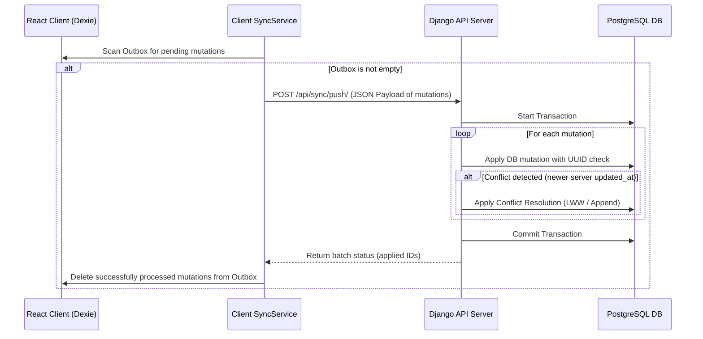
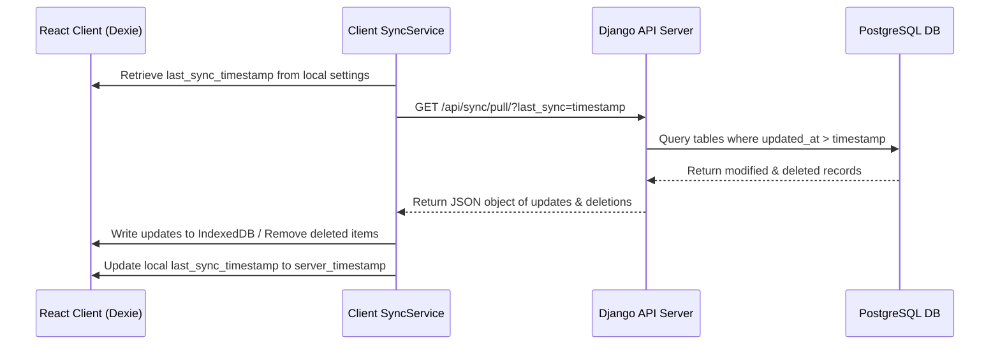

# High-Level Design & Architecture Documentation
**Version:** 1.0.0  
**Date:** June 8, 2026  

---

## 1. Architectural Style & Patterns

CampusOS follows an **Offline-First PWA + Centralized Cloud Backend** architecture pattern. It balances performance, security, and absolute reliability under intermittent network conditions.

```
       +-----------------------+                    +------------------------+
       |   User Interacting    |                    |  Centralized DB Admin  |
       +-----------+-----------+                    +-----------+------------+
                   |                                            |
                   v                                            v
     +-------------+-------------+                +-------------+------------+
     |     React UI (Frontend)   |                |   Django Admin Dashboard |
     +-------------+-------------+                +-------------+------------+
                   |                                            |
                   v                                            |
     +-------------+-------------+                              |
     |   Dexie / IndexedDB Store |                              |
     +-------------+-------------+                              |
                   |                                            |
         (Pushes Outbox / Pulls Increments)                     |
                   |                                            |
                   v                                            v
     +-------------+--------------------------------------------+------------+
     |                    Django REST Framework API                           |
     +----------------------------------+-------------------------------------+
                                        |
                                        v
     +----------------------------------+-------------------------------------+
     |                     PostgreSQL Database Server                        |
     +------------------------------------------------------------------------+
```

### Key Components

1. **React SPA & PWA Service Worker**:
   - Handles static assets caching via Workbox/Service Worker, ensuring the site loads and runs without network connectivity.
   - Built using Vite for optimal build size and hot module replacement.
2. **Dexie.js Local Database (IndexedDB)**:
   - Emulates the remote schema using schema declarations.
   - Performs ACID transactions on the client side, allowing instantaneous user feedback.
3. **Outbox Pattern Mutation Queue**:
   - Stores user-triggered actions (POST, PUT, DELETE operations) locally when offline.
   - Sequences mutations to prevent race conditions during playback.
4. **Django API & Sync Manager**:
   - Handles REST resources and security.
   - Provides specialized synchronization viewsets to reconcile local Outbox data.
   - Manages conflict resolution and transaction rollbacks on API failures.

---

## 2. Synchronization & Data Flow Sequences

### 2.1 Sync Push Protocol (Client to Server)
When the browser detects `navigator.onLine === true`, it triggers the outbox upload.



### 2.2 Sync Pull Protocol (Server to Client)
Once the Outbox is empty, the client queries for any server-side changes made since its last local pull operation.



---

## 3. Directory Structures

We will organize the codebases into backend and frontend root folders within the repository directory.

### 3.1 Backend Directory (`backend/`)
```
backend/
├── campus_os_backend/       # Django Project settings
│   ├── __init__.py
│   ├── settings.py
│   ├── urls.py
│   └── wsgi.py
├── core/                    # School structure app
│   ├── migrations/
│   ├── models.py
│   ├── views.py
│   └── urls.py
├── students/                # Student record management app
│   ├── models.py
│   └── views.py
├── finance/                 # Billing and payment receipts app
│   ├── models.py
│   └── views.py
├── assets/                  # Inventory app
│   ├── models.py
│   └── views.py
├── sync/                    # Reconciliation engine app
│   ├── models.py
│   ├── sync_handlers.py
│   └── views.py
├── manage.py
├── requirements.txt
└── .env.example
```

### 3.2 Frontend Directory (`frontend/`)
```
frontend/
├── public/                  # Static assets & manifest.json
├── src/
│   ├── assets/              # Stylesheets, icons, fonts
│   ├── components/          # Reusable components (Navbar, Button, etc.)
│   ├── db/
│   │   └── db.js            # Dexie.js Schema Configuration
│   ├── services/
│   │   ├── api.js           # Fetch wrapper with headers/JWT authentication
│   │   └── syncService.js   # Synchronization routines & interval checkers
│   ├── pages/
│   │   ├── Dashboard.jsx
│   │   ├── Students.jsx
│   │   ├── GradesEntry.jsx
│   │   ├── Finance.jsx
│   │   └── Assets.jsx
│   ├── App.jsx              # Routing & Application Layout
│   └── main.jsx
├── package.json
├── vite.config.js
└── index.html
```
